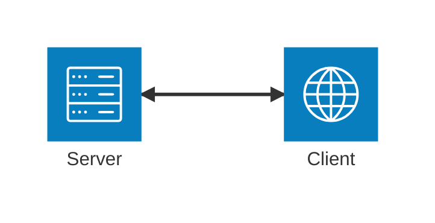
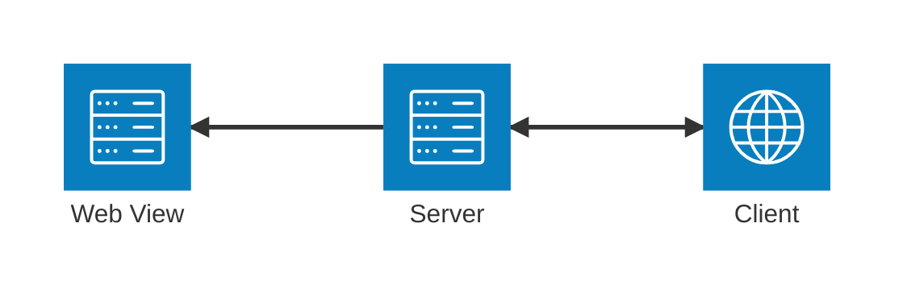

# Development

## Dependencies

- [rust](https://rustup.rs/)
- [just](https://just.systems/)
- [nvm](https://github.com/nvm-sh/nvm) or [nvm for windows](https://github.com/coreybutler/nvm-windows)/[node](https://nodejs.org/)
- [docker](https://www.docker.com/)

## Watch Mode

Running `just watch` will build the [types](./types/), [server](./server/), [client](./client/), and open the browser to http://localhost:3000. It will rebuild everything on change.

This also spins up the docker containers [kennethreitz/httpbin](https://hub.docker.com/r/kennethreitz/httpbin) and [ghcr.io/navikt/mock-oauth2-server](https://github.com/navikt/mock-oauth2-server/). These are used for some of the example reqlang files: [post.reqlang](./requests/post.reqlang), [auth2_openid_configuration.reqlang](./requests/auth2_openid_configuration.reqlang)

## Architecture

### Types

The [types](./types/) crate contains shared Rust types used by the server and transpiled to Typescript for use in the client. They are exposed as the local private npm package `server-types`.

### Server

The [server](./server/) is the backend API of the application.

- [rust](https://rustup.rs/)
- [axum](https://docs.rs/axum/latest/axum/)
- [tokio](https://tokio.rs/)
- [reqwest](https://docs.rs/reqwest/latest/reqwest/)

### Client

The [client](./client/) is the frontend UI of the application.

- [react](https://react.dev/)
- [tanstack-router](https://tanstack.com/router/latest)
- [tanstack-query](https://tanstack.com/query/latest)
- [tanstack-form](https://tanstack.com/form/latest)
- [zustand](https://github.com/pmndrs/zustand)
- [mantine](https://mantine.dev/getting-started/)

### App

The [app](./app/) is a webview wrapper around the server and client.

- [rust](https://rustup.rs/)
- [wry](https://docs.rs/wry/latest/wry/)
- [tao](https://docs.rs/tao/latest/tao/)

### Binaries

There are two binaries produced on build: `reqlang-web-browser` and `reqlang-web`.

#### reqlang-web-browser

The `reqlang-web-browser` binary is the server and client. The server acts as the backend API and statically serves the built client. This is primarily used during development.

#### reqlang-web

The `reqlang-web` binary is the server and client wrapped in a native web view. This is primarily used when running as a standalone app.

