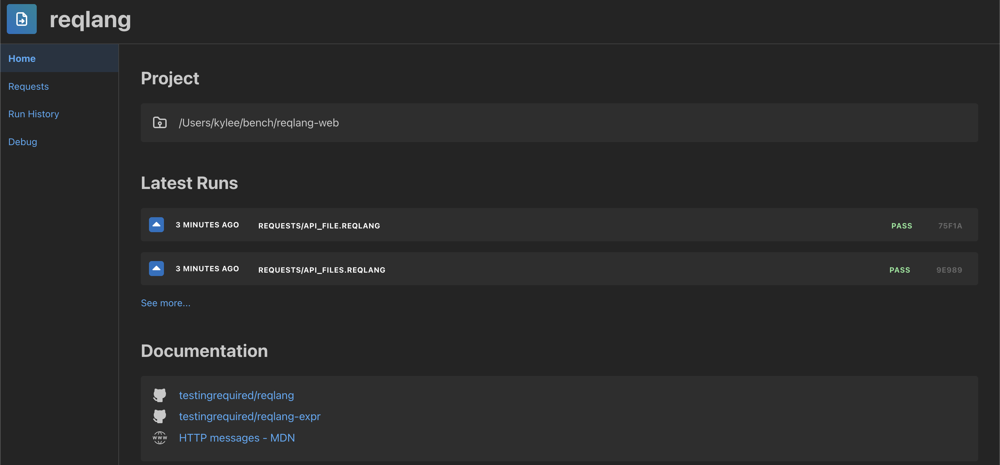
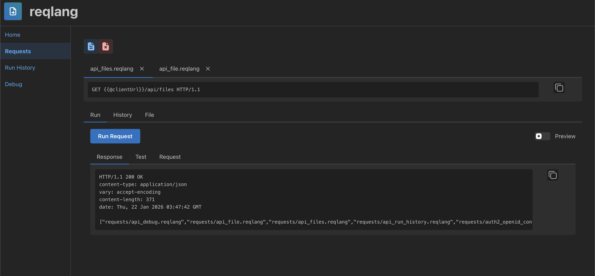
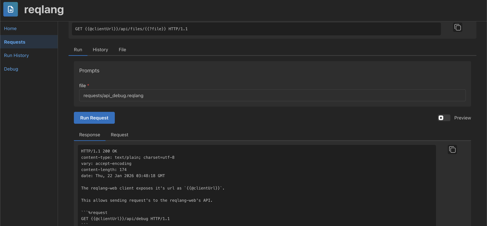
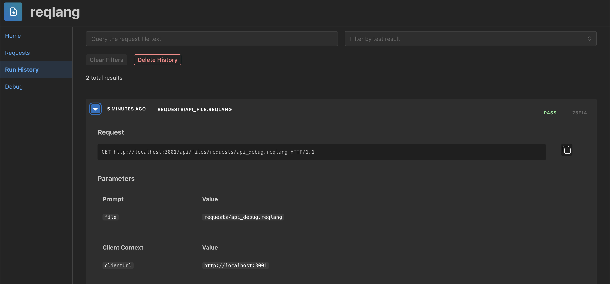

# reqlang-web

[](https://github.com/testingrequired/reqlang-web-client/actions/workflows/build-artifacts.yml)

A single binary webview executable REST client for [reqlang](https://github.com/testingrequired/reqlang).









## Usage

1. [Download](https://github.com/testingrequired/reqlang-web-client/actions/workflows/build-artifacts.yml)
2. Unzip the `reqlang-web` in a directory on the `PATH`
3. Optional/Recommended: Set environment variable `RQL_DB_KEY`. This encrypts application's sqlite database
4. Run `reqlang-web` from a terminal in a project directory containing request files

## Database Encryption

It's recommended to use an encrypted database to protect sensitive data such as secrets used in requests. Encrypting an existing database isn't supported yet so this must be done before first starting the app.

### Setting An Encryption Key

Add a `.env` file to your project's root before starting the app.

```shell
# The database's encryption key will be set to this key on first start up
RQL_DB_KEY=strongPassword1!
```

### Changing The Encryption Key

Update the `.env` file

```shell
# The database's existing encryption key
RQL_DB_KEY=strongPassword1!

# The database's encryption key will be changed to this key on start up
RQL_DB_REKEY=strongPassword2@
```

## Development

See [DEVELOPMENT.md](./DEVELOPMENT.md) for details.
